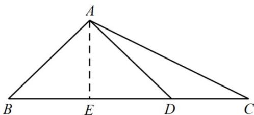
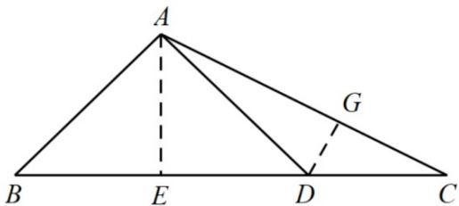

> [!faq]- 《专题19 解三角形大题综合》真题解析
>
> > [!success]- **【答案】** 详见解析
>
> > [!note]- **【分析】**
> > 【分析】（1）方法一：利用余弦定理求得 $b$ ，利用正弦定理求得 $\sin C$
> >
> > (2) 方法一：根据 $\cos\angle ADC$ 的值，求得 $\sin\angle ADC$ 的值，由 (1) 求得 $\cos C$ 的值，从而求得 $\sin\angle DAC, \cos\angle DAC$ 的值，进而求得 $\tan\angle DAC$ 的值.
>
> > [!note]- **【解析】**
> > 【详解】（1）[方法一]：正余弦定理综合法
> > 由余弦定理得 $b^{2}=a^{2}+c^{2}-2ac\cos B=9+2-2\times3\times\sqrt{2}\times\frac{\sqrt{2}}{2}=5$ ，所以 $b=\sqrt{5}$
> > 由正弦定理得 $\frac{c}{\sin C} = \frac{b}{\sin B} \Rightarrow \sin C = \frac{c \sin B}{b} = \frac{\sqrt{5}}{5}$ .
> > [方法二]【最优解】：几何法
> > 过点 A 作 $AE \perp BC$ ，垂足为 E。在 Rt△ABE 中，由 $c = \sqrt{2}, B = 45^{\circ}$ ，可得 AE = BE = 1，又 a = 3，所以 EC = 2。
> > 在 $\mathrm{Rt}\triangle ACE$ 中， $AC = \sqrt{AE^2 + EC^2} = \sqrt{5}$ ，因此 $\sin C = \frac{1}{\sqrt{5}} = \frac{\sqrt{5}}{5}$
> > 
> > (2) [方法一]: 两角和的正弦公式法
> > 由于 $\cos \angle ADC = -\frac{4}{5}$ ， $\angle ADC\in \left(\frac{\pi}{2},\pi\right)$ ，所以 $\sin \angle ADC = \sqrt{1 - \cos^2\angle ADC} = \frac{3}{5}.$
> > 由于 $\angle ADC \in \left(\frac{\pi}{2}, \pi\right)$ ，所以 $C \in \left(0, \frac{\pi}{2}\right)$ ，所以 $\cos C = \sqrt{1 - \sin^2 C} = \frac{2\sqrt{5}}{5}$ .
> > 所以 $\sin \angle DAC = \sin (\pi -\angle DAC) = \sin (\angle ADC + \angle C)$
> > $= \sin \angle ADC\cdot \cos C + \cos \angle ADC\cdot \sin C = \frac{3}{5}\times \frac{2\sqrt{5}}{5} +\left(-\frac{4}{5}\right)\times \frac{\sqrt{5}}{5} = \frac{2\sqrt{5}}{25}.$
> > 由于 $\angle DAC\in \left(0,\frac{\pi}{2}\right)$ ，所以 $\cos \angle DAC = \sqrt{1 - \sin^2\angle DAC} = \frac{11\sqrt{5}}{25}.$
> > 所以 $\tan\angle DAC=\frac{\sin\angle DAC}{\cos\angle DAC}=\frac{2}{11}$ .
> > ## [方法二]【最优解】：几何法+两角差的正切公式法
> > 在（1）的方法二的图中，由 $\cos \angle ADC = -\frac{4}{5}$ ，可得 $\cos \angle ADE = \cos (\pi -\angle ADC) = -\cos \angle ADC = \frac{4}{5}$ ，从而 $\sin \angle DAE = \cos \angle ADE = \frac{4}{5},\tan \angle DAE = \frac{\sin\angle DAE}{\cos\angle DAE} = \frac{4}{3}$ 。
> > 又由（1）可得 $\tan \angle EAC = \frac{EC}{AE} = 2$ ，所以 $\tan \angle DAC = \tan (\angle EAC - \angle EAD) = \frac{\tan\angle EAC - \tan\angle EAD}{1 + \tan\angle EAC\cdot\tan\angle EAD} = \frac{2}{11}$
> > ## [方法三]：几何法 $^{+}$ 正弦定理法
> > 在（1）的方法二中可得 $AE = 1, CE = 2, AC = \sqrt{5}$
> > 在 Rt△ADE 中， $AD=\frac{AE}{\sin\angle ADE}=\sqrt{5},ED=AD\cos\angle ADE=\frac{4}{3}$
> > 所以 $CD = CE - DE = \frac{2}{3}$
> > 在 $\triangle ACD$ 中，由正弦定理可得 $\sin \angle DAC = \frac{CD}{AD} \cdot \sin C = \frac{2\sqrt{5}}{25}$ ，
> > 由此可得 $\tan\angle DAC=\frac{2}{11}$
> > ## [方法四]：构造直角三角形法
> > 如图，作 $AE \perp BC$ ，垂足为 E，作 $DG \perp AC$ ，垂足为点 G。
> > 
> > 在（1）的方法二中可得 $AE = 1, CE = 2, AC = \sqrt{5}$
> > 由 $\cos \angle ADC = -\frac{4}{5}$ ，可得 $\cos \angle ADE = \frac{4}{5},\sin \angle ADE = \sqrt{1 - \cos^2\angle ADE} = \frac{3}{5}$
> > 在 $Rt^{\triangle}ADE$ 中， $AD = \frac{AE}{\sin\angle ADE} = \frac{5}{3}, DE = \sqrt{AD^2 - AE^2} = \frac{4}{3}, CD = CE - DE = \frac{2}{3}$
> > 由（1）知 $\sin C = \frac{\sqrt{5}}{5}$ ，所以在 Rt△ CDG 中， $DG = CD \cdot \sin C = \frac{2\sqrt{5}}{15}, CG = \sqrt{CD^2 - DG^2} = \frac{4\sqrt{5}}{15}$ ，从而 $AG = AC - CG = \frac{11\sqrt{5}}{15}$ 。在 Rt△ ADG 中， $\tan \angle DAG = \frac{DG}{AG} = \frac{2}{11}$ 。所以 $\tan \angle DAC = \frac{2}{11}$ 。
> > 【整体点评】（1）方法一：使用余弦定理求得 $b=\sqrt{5}$ ，然后使用正弦定理求得 $\sin C$ ；方法二：抓住 $^{45^{\circ}}$ 角的特点，作出辅助线，利用几何方法简单计算即得答案，运算尤其简洁，为最优解；（2）方法一：使用两角和的正弦公式求得 $\angle DAC$ 的正弦值，进而求解；方法二：适当作出辅助线，利用两角差的正切公式求解，运算更为简洁，为最优解；方法三：在几何法的基础上，使用正弦定理求得 $\angle DAC$ 的正弦值，进而得解；方法四：更多的使用几何的思维方式，直接作出含有 $\angle DAC$ 的直角三角形，进而求解，也是很优美的方法。
