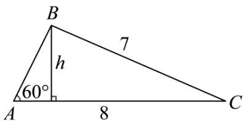
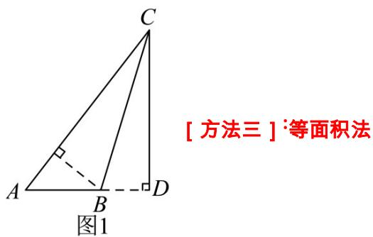

> [!faq]- 《专题19 解三角形大题综合》真题解析
>
> > [!success]- **【答案】** 详见解析
>
> > [!note]- **【分析】**
> > （1）方法一：先根据平方关系求 $\sin B$ ，再根据正弦定理求 $\sin A$ ，即得 $\angle A$ ；
> >
> > (2) 方法一：利用诱导公式以及两角和正弦公式求 $\sin C$ ，即可解得 $AC$ 边上的高。
>
> > [!note]- **【解析】**
> > （1）[方法一]：平方关系+正弦定理
> > 在 $\triangle ABC$ 中， $\because \cos B = -\frac{1}{7}, \therefore B \in \left(\frac{\pi}{2}, \pi\right), \therefore \sin B = \sqrt{1 - \cos^2 B} = \frac{4\sqrt{3}}{7}$ . 由正弦定理得
> > $$
> > \frac {a}{\sin A} = \frac {b}{\sin B} \Rightarrow \frac {7}{\sin A} = \frac {8}{\frac {4 \sqrt {3}}{7}}, \therefore \sin A = \frac {\sqrt {3}}{2}. \because B \in \left(\frac {\pi}{2}, \pi\right), \therefore A \in \left(0, \frac {\pi}{2}\right), \therefore \angle A = \frac {\pi}{3}.
> > $$
> > [方法二]：余弦定理的应用
> > 由余弦定理知 $b^{2}=a^{2}+c^{2}-2ac\cos B$ 。因为 $a=7,b=8,\cos B=-\frac{1}{7}$ ，代入上式可得 $c=3$ 或 $c=-5$ （舍）。所以 $\cos A=\frac{b^{2}+c^{2}-a^{2}}{2bc}=\frac{1}{2}$ ，又 $A\in(0,\pi)$ ，所以 $A=\frac{\pi}{3}$ 。
> > (2) [方法一]：两角和的正弦公式 + 锐角三角函数的定义
> > 在 $\triangle ABC$ 中，
> > $$
> > \sin C = \sin (A + B) = \sin A \cos B + \sin B \cos A = \frac {\sqrt {3}}{2} \times \left(- \frac {1}{7}\right) + \frac {1}{2} \times \frac {4 \sqrt {3}}{7} = \frac {3 \sqrt {3}}{1 4}.
> > $$
> > 如图所示，在 $\triangle ABC$ 中， $\because \sin C = \frac{h}{BC}$ ， $\therefore h = BC \cdot \sin C = 7 \times \frac{3\sqrt{3}}{14} = \frac{3\sqrt{3}}{2}$ ，
> > $\therefore AC$ 边上的高为 $\frac{3\sqrt{3}}{2}$
> > 
> > [方法二]：解直角三角形+锐角三角函数的定义
> > 如图1，由（1）得 $AD = AC\cos \angle A = 8\times \frac{1}{2} = 4$ ，则 $AB = 4 - 7\times \frac{1}{7} = 3$
> > 作 $BE \perp AC$ ，垂足为 $E$ ，则 $BE = AB\sin \angle A = 3 \times \frac{\sqrt{3}}{2} = \frac{3\sqrt{3}}{2}$ ，故 $AC$ 边上的高为 $\frac{3\sqrt{3}}{2}$
> > 
> > [方法三] 等面积法
> > 由（1）得 $\angle A = 60^{\circ}$ ，易求 $CD = 4\sqrt{3}$ .如图1，作 $CD\perp AB$ ，易得 $AD = 4$ ，即 $AB = 3$ .所以根据等积法有 $\frac{1}{2}\cdot AC\cdot BE = \frac{1}{2}\cdot AB\cdot AC\cdot \sin A$ ，即 $BE = 3\times \frac{\sqrt{3}}{2}$
> > 所以 $AC$ 边上的高为 $\frac{3\sqrt{3}}{2}$
> > 【整体点评】（ $^{1}$ ）方法一：已知两边及一边对角，利用正弦定理求出；
> > 方法二：已知两边及一边对角，先利用余弦定理求出第三边，再根据余弦定理求出角；
> > (2) 方法一：利用两角和的正弦公式求出第三个角，再根据锐角三角函数的定义求出；
> > 方法二：利用初中平面几何知识，通过锐角三角函数定义解直角三角形求出；
> > 方法三：利用初中平面几何知识，通过等面积法求出。
