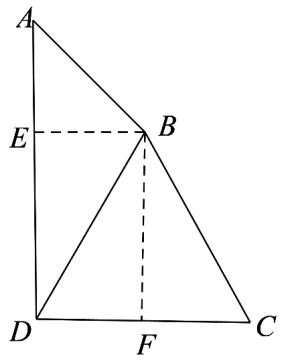

> [!faq]- 《专题19 解三角形大题综合》真题解析
>
> > [!success]- **【答案】** 详见解析
>
> > [!note]- **【分析】**
> > 【分析】（1）方法一：根据正弦定理得到 $\frac{BD}{\sin\angle A} = \frac{AB}{\sin\angle ADB}$ ，求得 $\sin \angle ADB = \frac{\sqrt{2}}{5}$ ，结合角的范围，利用同角三角函数关系式，求得 $\cos \angle ADB = \sqrt{1 - \frac{2}{25}} = \frac{\sqrt{23}}{5}$ ；
> >
> > (2) 方法一：根据第一问的结论可以求得 $\cos\angle BDC = \sin\angle ADB = \frac{\sqrt{2}}{5}$ ，在 $\triangle BCD$ 中，根据余弦定理即可求出．
>
> > [!note]- **【解析】**
> > 【详解】（ $^{1}$ ）[方法 $^{1}$ ]：正弦定理+平方关系
> > 在 $\triangle ABD$ 中，由正弦定理得 $\frac{BD}{\sin\angle A} = \frac{AB}{\sin\angle ADB}$ ，代入数值并解得 $\sin \angle ADB = \frac{\sqrt{2}}{5}$ 。又因为 $BD > AB$ ，所以 $\angle A > \angle ADB$ ，即 $\angle ADB$ 为锐角，所以 $\cos \angle ADB = \frac{\sqrt{23}}{5}$ 。
> > [方法 $^{2}$ ]：余弦定理
> > 在 $\triangle ABD$ 中， $BD^{2} = AB^{2} + AD^{2} - 2AB\cdot AD\cos 45^{\circ}$ ，即 $25 = 4 + AD^{2} - 2\times 2\times AD\times \frac{\sqrt{2}}{2}$ ，解得：
> > $AD = \sqrt{2} + \sqrt{23}$ ，所以，
> > $$
> > \cos \angle A D B = \frac {(\sqrt {2} + \sqrt {2 3}) ^ {2} + 2 5 - 4}{2 \times (\sqrt {2} + \sqrt {2 3}) \times 5} = \frac {\sqrt {2 3}}{5}
> > $$
> > [方法 $^{3}$ ]：【最优解】利用平面几何知识
> > 如图，过 $B$ 点作 $BE \perp AD$ ，垂足为 $E$ ， $BF \perp CD$ ，垂足为 $F$ 。在 Rt△AEB 中，因为 $\angle A = 45^{\circ}$ ， $AB = 2$ ，所以 $AE = BE = \sqrt{2}$ 。在 Rt△BED 中，因为 $BD = 5$ ，则 $DE = \sqrt{BD^{2} - BE^{2}} = \sqrt{5^{2} - (\sqrt{2})^{2}} = \sqrt{23}$ 。
> > 所以 $\cos \angle ADB = \frac{\sqrt{23}}{5}$
> > 
> > [方法 $^{4}$ ]：坐标法
> > 以 $D$ 为坐标原点， $\overline{DC}$ 为 $x$ 轴， $\overline{DA}$ 为 $y$ 轴正方向，建立平面直角坐标系（图略）.
> > 设 $\angle BDC = \alpha$ ，则 $B(5\cos \alpha ,5\sin \alpha)$ 。因为 $\angle A = 45^{\circ}$ ，所以 $A(0,5\sin \alpha +\sqrt{2})$
> > 从而 $AB = \sqrt{(0 - 5\cos\alpha)^2 + (5\sin\alpha + \sqrt{2} - 5\sin\alpha)^2} = 2$ ，又 $\alpha$ 是锐角，所以 $\cos\alpha = \frac{\sqrt{2}}{5}$
> > $$
> > \cos \angle A D B = \sin \alpha = \sqrt {1 - \cos^ {2} \alpha} = \frac {\sqrt {2 3}}{5}
> > $$
> > $^{2}$ [方法 $^{1}$ ]：【通性通法】余弦定理
> > 在 $\triangle BCD$ ，由（1）得， $\cos \angle ADB = \frac{\sqrt{23}}{5}$ ， $BC^2 = BD^2 +DC^2 -2BD\cdot DC\cos (90^\circ -\angle ADB)$
> > $= 5^{2} + (2\sqrt{2})^{2} - 2 \times 5 \times 2\sqrt{2} \sin \angle ADB = 25$ ，所以 $BC = 5$
> > [方法 $^{2}$ ]：【最优解】利用平面几何知识
> > 作 $BF \perp DC$ ，垂足为 $F$ ，易求， $BF = \sqrt{23}$ ， $FC = \sqrt{2}$ ，由勾股定理得 $BC = 5$ 。
> > 【整体点评】（1）方法一：根据题目条件已知两边和一边对角，利用正弦定理和平方关系解三角形，属于通性通法；
> > 方法二：根据题目条件已知两边和一边对角，利用余弦定理解三角形，也属于通性通法；
> > 方法三：根据题意利用几何知识，解直角三角形，简单易算。
> > 方法四：建立坐标系，通过两点间的距离公式，将几何问题转化为代数问题，这是解析思想的体现。
> > (2) 方法一：已知两边及夹角，利用余弦定理解三角形，是通性通法.
> > 方法二：利用几何知识，解直角三角形，简单易算。
