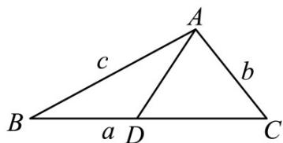

> [!faq]- 《专题19 解三角形大题综合》真题解析
>
> > [!success]- **【答案】** $\sqrt{10}$ 【详解】试题分析：根据题意，设出 $\Delta ABC$ 的内角 $A, B, C$ 所对边的长分别是 $a, b, c$ ，由余弦定理求出 $a$ 的长度，再由正弦定理求出角 $B$ 的大小，在 $\Delta ABD$ 中·利用正弦定理即可求出 $AD$ 的长度· 试题
>
> > [!note]- **【分析】**
> > 本题未单列分析。
>
> > [!note]- **【解析】**
> > 如图，
> > 
> > 设 $\Delta ABC$ 的内角 A, B, C 所对边的长分别是 a, b, c，由余弦定理得
> > $$
> > a ^ {2} = b ^ {2} + c ^ {2} - 2 b c \cos \angle B A C = (3 \sqrt {2}) ^ {2} + 6 ^ {2} - 2 \times 3 \sqrt {2} \times 6 \times \cos \frac {3 \pi}{4} = 1 8 + 3 6 - (- 3 6) = 9 0
> > $$
> > 所以 $a = 3\sqrt{10}$
> > 又由正弦定理得 $\sin B = \frac{b \sin \angle BAC}{a} = \frac{3}{3\sqrt{10}} = \frac{\sqrt{10}}{10}$ .
> > 由题设知 $0 < B < \frac{\pi}{4}$ ，所以 $\cos B = \sqrt{1 - \sin^2 B} = \sqrt{1 - \frac{1}{10}} = \frac{3\sqrt{10}}{10}$ .
> > 在 $\Delta ABD$ 中，由正弦定理得 $AD = \frac{AB\cdot\sin B}{\sin(\pi - 2B)} = \frac{6\sin B}{2\sin B\cos B} = \frac{3}{\cos B} = \sqrt{10}$
> > 考点： $^{1}$ ·正弦定理、余弦定理的应用·
