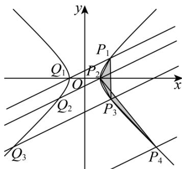

> [!faq]- 《专题20 数列的通项公式及数列求和大题综合》真题解析
>
> > [!success]- **【答案】** 详见解析
>
> > [!note]- **【分析】**
> > （1）直接根据题目中的构造方式计算出 $P_{2}$ 的坐标即可；
> >
> > (2) 根据等比数列的定义即可验证结论；
> >
> > (3) 思路一：使用平面向量数量积和等比数列工具，证明 $S_{n}$ 的取值为与 $n$ 无关的定值即可·思路二：使用等差数列工具，证明 $S_{n}$ 的取值为与 $n$ 无关的定值即可·
>
> > [!note]- **【解析】**
> > （1）
> > 
> > 由已知有 $m = 5^{2} - 4^{2} = 9$ ，故 C 的方程为 $x^{2} - y^{2} = 9$ 。
> > 当 $k = \frac{1}{2}$ 时，过 $P_{1}(5,4)$ 且斜率为 $\frac{1}{2}$ 的直线为 $y = \frac{x + 3}{2}$ ，与 $x^{2} - y^{2} = 9$ 联立得到 $x^{2} - \left(\frac{x + 3}{2}\right)^{2} = 9$ 。解得 $x = -3$ 或 $x = 5$ ，所以该直线与 $C$ 的不同于 $P_{1}$ 的交点为 $Q_{1}(-3,0)$ ，该点显然在 $C$ 的左支上。故 $P_{2}(3,0)$ ，从而 $x_{2} = 3$ ， $y_{2} = 0$ 。
> > (2) 由于过 $P_{n}(x_{n}, y_{n})$ 且斜率为 $k$ 的直线为 $y = k(x - x_{n}) + y_{n}$ ，与 $x^{2} - y^{2} = 9$ 联立，得到方程 $x^{2} - (k(x - x_{n}) + y_{n})^{2} = 9$ .
> > 展开即得 $\left(1 - k^2\right)x^2 - 2k(y_n - kx_n)x - \left(y_n - kx_n\right)^2 - 9 = 0$ ，由于 $P_n(x_n, y_n)$ 已经是直线 $y = k(x - x_n) + y_n$ 和 $x^2 - y^2 = 9$ 的公共点，故方程必有一根 $x = x_n$ 。
> > 从而根据韦达定理，另一根 $x = \frac{2k(y_n - kx_n)}{1 - k^2} - x_n = \frac{2ky_n - x_n - k^2x_n}{1 - k^2}$ ，相应的
> > $$
> > y = k \left(x - x _ {n}\right) + y _ {n} = \frac {y _ {n} + k ^ {2} y _ {n} - 2 k x _ {n}}{1 - k ^ {2}}.
> > $$
> > 所以该直线与 $C$ 的不同于 $P_{n}$ 的交点为 $Q_{n}\left(\frac{2ky_{n} - x_{n} - k^{2}x_{n}}{1 - k^{2}},\frac{y_{n} + k^{2}y_{n} - 2kx_{n}}{1 - k^{2}}\right)$ ，而注意到 $Q_{n}$ 的横坐标亦可通过韦达定理表示为 $\frac{-(y_n - kx_n)^2 - 9}{(1 - k^2)x_n}$ ，故 $Q_{n}$ 一定在 $C$ 的左支上·
> > 所以 $P_{n + 1}\left(\frac{x_n + k^2x_n - 2ky_n}{1 - k^2},\frac{y_n + k^2y_n - 2kx_n}{1 - k^2}\right).$
> > 这就得到 $x_{n + 1} = \frac{x_n + k^2x_n - 2ky_n}{1 - k^2}$ ， $y_{n + 1} = \frac{y_n + k^2y_n - 2kx_n}{1 - k^2}$
> > 所以 $x_{n+1}-y_{n+1}=\frac{x_{n}+k^{2}x_{n}-2ky_{n}}{1-k^{2}}-\frac{y_{n}+k^{2}y_{n}-2kx_{n}}{1-k^{2}}$
> > $$
> > = \frac {x _ {n} + k ^ {2} x _ {n} + 2 k x _ {n}}{1 - k ^ {2}} - \frac {y _ {n} + k ^ {2} y _ {n} + 2 k y _ {n}}{1 - k ^ {2}} = \frac {1 + k ^ {2} + 2 k}{1 - k ^ {2}} \left(x _ {n} - y _ {n}\right) = \frac {1 + k}{1 - k} \left(x _ {n} - y _ {n}\right).
> > $$
> > 再由 $x_{1}^{2} - y_{1}^{2} = 9$ ，就知道 $x_{1} - y_{1}\neq 0$ ，所以数列 $\{x_n - y_n\}$ 是公比为 $\frac{1 + k}{1 - k}$ 的等比数列
> > (3) 方法一：先证明一个结论：对平面上三个点 $U, V, W$ ，若 $\overline{UV} = (a, b)$ ， $\overline{UW} = (c, d)$ ，则 $S_{\triangle UVW} = \frac{1}{2}|ad - bc|$ 。（若 $U, V, W$ 在同一条直线上，约定 $S_{\triangle UVW} = 0$ ）
> > 证明： $S_{\triangle UVW} = \frac{1}{2}\left|\overline{UV}\right|\cdot \left|\overline{UW}\right|\sin \overline{UV},\overline{UW} = \frac{1}{2}\left|\overline{UV}\right|\cdot \left|\overline{UW}\right|\sqrt{1 - \cos^2 UV,UW}$
> > $$
> > \begin{array}{l} = \frac {1}{2} \left| \overrightarrow {U V} \right| \cdot \left| \overrightarrow {U W} \right| \sqrt {1 - \left(\frac {\overrightarrow {U V} \cdot \overrightarrow {U W}}{\left| U V \right| \cdot \left| U W \right|}\right) ^ {2}} = \frac {1}{2} \sqrt {\left| \overrightarrow {U V} \right| ^ {2} \cdot \left| \overrightarrow {U W} \right| ^ {2} - \left(\overrightarrow {U V} \cdot \overrightarrow {U W}\right) ^ {2}} \\ = \frac {1}{2} \sqrt {\left(a ^ {2} + b ^ {2}\right) \left(c ^ {2} + d ^ {2}\right) - (a c + b d) ^ {2}} \\ = \frac {1}{2} \sqrt {a ^ {2} c ^ {2} + a ^ {2} d ^ {2} + b ^ {2} c ^ {2} + b ^ {2} d ^ {2} - a ^ {2} c ^ {2} - b ^ {2} d ^ {2} - 2 a b c d} \\ = \frac {1}{2} \sqrt {a ^ {2} d ^ {2} + b ^ {2} c ^ {2} - 2 a b c d} = \frac {1}{2} \sqrt {(a d - b c) ^ {2}} = \frac {1}{2} | a d - b c |. \end{array}
> > $$
> > 证毕，回到原题·
> > 由于上一小问已经得到 $x_{n + 1} = \frac{x_n + k^2x_n - 2ky_n}{1 - k^2}$ ， $y_{n + 1} = \frac{y_n + k^2y_n - 2kx_n}{1 - k^2}$
> > $$
> > x _ {n + 1} + y _ {n + 1} = \frac {x _ {n} + k ^ {2} x _ {n} - 2 k y _ {n}}{1 - k ^ {2}} + \frac {y _ {n} + k ^ {2} y _ {n} - 2 k x _ {n}}{1 - k ^ {2}} = \frac {1 + k ^ {2} - 2 k}{1 - k ^ {2}} \left(x _ {n} + y _ {n}\right) = \frac {1 - k}{1 + k} \left(x _ {n} + y _ {n}\right).
> > $$
> > 再由 $x_{1}^{2} - y_{1}^{2} = 9$ ，就知道 $x_{1} + y_{1}\neq 0$ ，所以数列 $\left\{x_n + y_n\right\}$ 是公比为 $\frac{1 - k}{1 + k}$ 的等比数列
> > 所以对任意的正整数 m ，都有
> > $$
> > \begin{array}{l} x _ {n} y _ {n + m} - y _ {n} x _ {n + m} \\ = \frac {1}{2} \left(\left(x _ {n} x _ {n + m} - y _ {n} y _ {n + m}\right) + \left(x _ {n} y _ {n + m} - y _ {n} x _ {n + m}\right)\right) - \frac {1}{2} \left(\left(x _ {n} x _ {n + m} - y _ {n} y _ {n + m}\right) - \left(x _ {n} y _ {n + m} - y _ {n} x _ {n + m}\right)\right) \\ = \frac {1}{2} \left(x _ {n} - y _ {n}\right) \left(x _ {n + m} + y _ {n + m}\right) - \frac {1}{2} \left(x _ {n} + y _ {n}\right) \left(x _ {n + m} - y _ {n + m}\right) \\ = \frac {1}{2} \left(\frac {1 - k}{1 + k}\right) ^ {m} \left(x _ {n} - y _ {n}\right) \left(x _ {n} + y _ {n}\right) - \frac {1}{2} \left(\frac {1 + k}{1 - k}\right) ^ {m} \left(x _ {n} + y _ {n}\right) \left(x _ {n} - y _ {n}\right) \end{array}
> > $$
> > $$
> > \begin{array}{r l} & {= \frac {1}{2} \Bigg (\bigg (\frac {1 - k}{1 + k} \bigg) ^ {m} - \bigg (\frac {1 + k}{1 - k} \bigg) ^ {m} \Bigg) \Big (x _ {n} ^ {2} - y _ {n} ^ {2} \Big)} \\ & {= \frac {9}{2} \Bigg (\bigg (\frac {1 - k}{1 + k} \bigg) ^ {m} - \bigg (\frac {1 + k}{1 - k} \bigg) ^ {m} \Bigg).} \\ & {\text {而又有} P _ {n + 1} P _ {n} = \left(- \left(x _ {n + 1} - x _ {n}\right), - \left(y _ {n + 1} - y _ {n}\right)\right), P _ {n + 1} P _ {n + 2} = \left(x _ {n + 2} - x _ {n + 1}, y _ {n + 2} - y _ {n + 1}\right),} \end{array}
> > $$
> > 故利用前面已经证明的结论即得
> > $$
> > \begin{array}{l} S _ {n} = S _ {\triangle P _ {n} P _ {n + 1} P _ {n + 2}} = \frac {1}{2} \left| - \left(x _ {n + 1} - x _ {n}\right) \left(y _ {n + 2} - y _ {n + 1}\right) + \left(y _ {n + 1} - y _ {n}\right) \left(x _ {n + 2} - x _ {n + 1}\right) \right| \\ = \frac {1}{2} \left| \left(x _ {n + 1} - x _ {n}\right) \left(y _ {n + 2} - y _ {n + 1}\right) - \left(y _ {n + 1} - y _ {n}\right) \left(x _ {n + 2} - x _ {n + 1}\right) \right| \\ = \frac {1}{2} \left| \left(x _ {n + 1} y _ {n + 2} - y _ {n + 1} x _ {n + 2}\right) + \left(x _ {n} y _ {n + 1} - y _ {n} x _ {n + 1}\right) - \left(x _ {n} y _ {n + 2} - y _ {n} x _ {n + 2}\right) \right| \\ = \frac {1}{2} \left| \frac {9}{2} \left(\frac {1 - k}{1 + k} - \frac {1 + k}{1 - k}\right) + \frac {9}{2} \left(\frac {1 - k}{1 + k} - \frac {1 + k}{1 - k}\right) - \frac {9}{2} \left(\left(\frac {1 - k}{1 + k}\right) ^ {2} - \left(\frac {1 + k}{1 - k}\right) ^ {2}\right) \right|. \end{array}
> > $$
> > 这就表明 $S_{n}$ 的取值是与 $n$ 无关的定值，所以 $S_{n} = S_{n + 1}$
> > 方法二：由于上一小问已经得到 $x_{n + 1} = \frac{x_n + k^2x_n - 2ky_n}{1 - k^2}$ ， $y_{n + 1} = \frac{y_n + k^2y_n - 2kx_n}{1 - k^2}$
> > $$
> > \text {故} x _ {n + 1} + y _ {n + 1} = \frac {x _ {n} + k ^ {2} x _ {n} - 2 k y _ {n}}{1 - k ^ {2}} + \frac {y _ {n} + k ^ {2} y _ {n} - 2 k x _ {n}}{1 - k ^ {2}} = \frac {1 + k ^ {2} - 2 k}{1 - k ^ {2}} \left(x _ {n} + y _ {n}\right) = \frac {1 - k}{1 + k} \left(x _ {n} + y _ {n}\right).
> > $$
> > 再由 $x_{1}^{2} - y_{1}^{2} = 9$ ，就知道 $x_{1} + y_{1}\neq 0$ ，所以数列 $\{x_n + y_n\}$ 是公比为 $\frac{1 - k}{1 + k}$ 的等比数列
> > 所以对任意的正整数 m ，都有
> > $$
> > \begin{array}{l} x _ {n} y _ {n + m} - y _ {n} x _ {n + m} \\ = \frac {1}{2} \left(\left(x _ {n} x _ {n + m} - y _ {n} y _ {n + m}\right) + \left(x _ {n} y _ {n + m} - y _ {n} x _ {n + m}\right)\right) - \frac {1}{2} \left(\left(x _ {n} x _ {n + m} - y _ {n} y _ {n + m}\right) - \left(x _ {n} y _ {n + m} - y _ {n} x _ {n + m}\right)\right) \\ = \frac {1}{2} \left(x _ {n} - y _ {n}\right) \left(x _ {n + m} + y _ {n + m}\right) - \frac {1}{2} \left(x _ {n} + y _ {n}\right) \left(x _ {n + m} - y _ {n + m}\right) \\ = \frac {1}{2} \left(\frac {1 - k}{1 + k}\right) ^ {m} \left(x _ {n} - y _ {n}\right) \left(x _ {n} + y _ {n}\right) - \frac {1}{2} \left(\frac {1 + k}{1 - k}\right) ^ {m} \left(x _ {n} + y _ {n}\right) \left(x _ {n} - y _ {n}\right) \\ = \frac {1}{2} \left(\left(\frac {1 - k}{1 + k}\right) ^ {m} - \left(\frac {1 + k}{1 - k}\right) ^ {m}\right) \left(x _ {n} ^ {2} - y _ {n} ^ {2}\right) \\ = \frac {9}{2} \left(\left(\frac {1 - k}{1 + k}\right) ^ {m} - \left(\frac {1 + k}{1 - k}\right) ^ {m}\right). \end{array}
> > $$
> > 这就得到 $x_{n + 2}y_{n + 3} - y_{n + 2}x_{n + 3} = \frac{9}{2}\left(\frac{1 - k}{1 + k} -\frac{1 + k}{1 - k}\right) = x_ny_{n + 1} - y_nx_{n + 1}$
> > 以及 $x_{n + 1}y_{n + 3} - y_{n + 1}x_{n + 3} = \frac{9}{2}\left(\left(\frac{1 - k}{1 + k}\right)^2 -\left(\frac{1 + k}{1 - k}\right)^2\right) = x_ny_{n + 2} - y_nx_{n + 2}.$
> > 两式相减，即得 $\left(x_{n + 2}y_{n + 3} - y_{n + 2}x_{n + 3}\right) - \left(x_{n + 1}y_{n + 3} - y_{n + 1}x_{n + 3}\right) = \left(x_ny_{n + 1} - y_nx_{n + 1}\right) - \left(x_ny_{n + 2} - y_nx_{n + 2}\right).$
> > 移项得到 $x_{n + 2}y_{n + 3} - y_n x_{n + 2} - x_{n + 1}y_{n + 3} + y_n x_{n + 1} = y_{n + 2}x_{n + 3} - x_n y_{n + 2} - y_{n + 1}x_{n + 3} + x_n y_{n + 1}$
> > 故 $\left(y_{n+3}-y_{n}\right)\left(x_{n+2}-x_{n+1}\right)=\left(y_{n+2}-y_{n+1}\right)\left(x_{n+3}-x_{n}\right)$ .
> > 而 $P_{n}P_{n + 3} = (x_{n + 3} - x_n,y_{n + 3} - y_n)$ ， $P_{n + 1}P_{n + 2} = (x_{n + 2} - x_{n + 1},y_{n + 2} - y_{n + 1})$
> > 所以 $P_{n}P_{n + 3}$ 和 $P_{n + 1}P_{n + 2}$ 平行，这就得到 $S_{\triangle P_nP_{n + 1}P_{n + 2}} = S_{\triangle P_{n + 1}P_{n + 2}P_{n + 3}}$ ，即 $S_{n} = S_{n + 1}$
> > 【点睛】关键点点睛：本题的关键在于将解析几何和数列知识的结合，需要综合运用多方面知识方可得解·3．（2023·全国新I卷·高考真题）甲、乙两人投篮，每次由其中一人投篮，规则如下：若命中则此人继续投篮，若末命中则换为对方投篮．无论之前投篮情况如何，甲每次投篮的命中率均为 $^{0.6}$ ，乙每次投篮的命中率均为 $^{0.8}$ ．由抽签确定第1次投篮的人选，第1次投篮的人是甲、乙的概率各为 $^{0.5}$ ．
> > (1)求第2次投篮的人是乙的概率；
> > (2)求第i次投篮的人是甲的概率；
> > (3)已知：若随机变量 $X_{i}$ 服从两点分布，且 $P(X_{i} = 1) = 1 - P(X_{i} = 0) = q_{i}, i = 1,2,\dots ,n$ ，则 $E\left(\sum_{i = 1}^{n}X_{i}\right) = \sum_{i = 1}^{n}q_{i}$ 记前 $n$ 次（即从第1次到第 $n$ 次投篮）中甲投篮的次数为 $Y$ ，求 $E(Y)$ ：
> > 【答案】(1)0.6
> > (2) $\frac{1}{6} \times \left(\frac{2}{5}\right)^{i-1} + \frac{1}{3}$
> > (3) $E(Y) = \frac{5}{18}\left[1 - \left(\frac{2}{5}\right)^n\right] + \frac{n}{3}$
> > 【分析】（ $^{1}$ ）根据全概率公式即可求出；
> > (2) 设 $P(A_i) = p_i$ ，由题意可得 $p_{i+1} = 0.4p_i + 0.2$ ，根据数列知识，构造等比数列即可解出；
> > (3) 先求出两点分布的期望，再根据题中的结论以及等比数列的求和公式即可求出.
> > 【详解】（1）记“第i次投篮的人是甲”为事件 $A_{i}$ ，“第i次投篮的人是乙”为事件 $B_{i}$
> > 所以， $P(B_{2}) = P(A_{1}B_{2}) + P(B_{1}B_{2}) = P(A_{1})P(B_{2}|A_{1}) + P(B_{1})P(B_{2}|B_{1})$
> > $$
> > = 0. 5 \times (1 - 0. 6) + 0. 5 \times 0. 8 = 0. 6
> > $$
> > (2) 设 $P(A_i) = p_i$ ，依题可知， $P(B_i) = 1 - p_i$ ，则
> > $$
> > P \left(A _ {i + 1}\right) = P \left(A _ {i} A _ {i + 1}\right) + P \left(B _ {i} A _ {i + 1}\right) = P \left(A _ {i}\right) P \left(A _ {i + 1} \mid A _ {i}\right) + P \left(B _ {i}\right) P \left(A _ {i + 1} \mid B _ {i}\right)
> > $$
> > 即 $p_{i + 1} = 0.6p_i + (1 - 0.8)\times (1 - p_i) = 0.4p_i + 0.2$
> > 构造等比数列 $\left\{p_{i}+\lambda\right\}$ ，
> > 设 $p_{i + 1} + \lambda = \frac{2}{5}\left(p_i + \lambda\right)$ ，解得 $\lambda = -\frac{1}{3}$ ，则 $p_{i + 1} - \frac{1}{3} = \frac{2}{5}\left(p_i - \frac{1}{3}\right)$
> > 又 $p_1 = \frac{1}{2}, p_1 - \frac{1}{3} = \frac{1}{6}$ ，所以 $\left\{p_i - \frac{1}{3}\right\}$ 是首项为 $\frac{1}{6}$ ，公比为 $\frac{2}{5}$ 的等比数列，
> > 即 $p_i - \frac{1}{3} = \frac{1}{6} \times \left(\frac{2}{5}\right)^{i-1}, p_i = \frac{1}{6} \times \left(\frac{2}{5}\right)^{i-1} + \frac{1}{3}$ .
> > (3) 因为 $p_{i}=\frac{1}{6}\times\left(\frac{2}{5}\right)^{i-1}+\frac{1}{3}$ ， $i=1,2,\cdots,n$ ，
> > 所以当时， $E(Y)=p_{1}+p_{2}+\cdots+p_{n}=\frac{1}{6}\times\frac{1-\left(\frac{2}{5}\right)^{n}}{1-\frac{2}{5}}+\frac{n}{3}=\frac{5}{18}\left[1-\left(\frac{2}{5}\right)^{n}\right]+\frac{n}{3}$
> > 故 $E(Y) = \frac{5}{18}\left[1 - \left(\frac{2}{5}\right)^n\right] + \frac{n}{3}$
> > 【点睛】本题第一问直接考查全概率公式的应用，后两问的解题关键是根据题意找到递推式，然后根据数列的基本知识求解。
