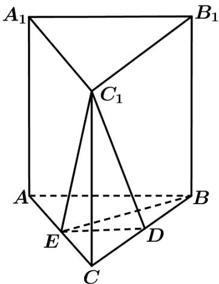

<!-- question-source:start -->
16. (2019·江苏·高考真题) 如图, 在直三棱柱 $ABC - A_{1}B_{1}C_{1}$ 中, $D$ , $E$ 分别为 $BC$ , $AC$ 的中点, $AB=BC$ .

求证： $
<!-- question-source:end -->

![[高中/真题/按题型分类/专题21 立体几何大题综合/考点01_空间中的平行关系_第一问_/对点训练/answers/Q00055366A1.md]]
