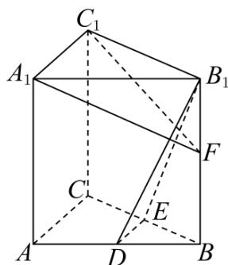

<!-- question-source:start -->
28. (2016·江苏·高考真题) 如图, 在直三棱柱 $ABC-A_{1}B_{1}C_{1}$ 中, $D$ , $E$ 分别为 $AB$ , $BC$ 的中点, 点 $F$ 在侧棱 $B_{1}B$ 上, 且 $B_{1}D \perp A_{1}F$ , $A_{1}C_{1} \perp A_{1}B_{1}$ .

求证： $
<!-- question-source:end -->

![[高中/真题/按题型分类/专题21 立体几何大题综合/考点01_空间中的平行关系_第一问_/对点训练/answers/Q00055376A1.md]]
