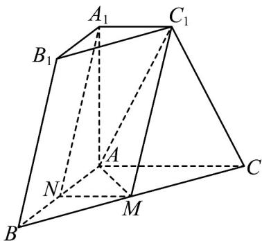

> [!faq]- 《zhenti-专题21 立体几何大题综合》例题解析
>
> > [!success]- **【答案】** B
>
> > [!note]- **【分析】**
> > （1）先证明四边形 $MNA_{1}C_{1}$ 是平行四边形，然后用线面平行的判定解决；
>
> > [!note]- **【解析】**
> > （1）
> >
> > 
> >
> > 连接 $MN, C_1A \cdot$ 由 $M, N$ 分别是 $BC, BA$ 的中点，根据中位线性质， $MN // AC$ ，且 $MN = \frac{AC}{2} = 1$
> >
> > 由棱台性质， $A_{1}C_{1}//AC$ ，于是 $MN//A_{1}C_{1}$ ，由 $MN=A_{1}C_{1}=1$ 可知，四边形 $MNA_{1}C_{1}$ 是平行四边形，则 $A_{1}N//MC_{1}$ ，
> >
> > 又 $A_{1}N \not\subset$ 平面 $C_{1}MA$ ， $MC_{1} \subset$ 平面 $C_{1}MA$ ，于是 $A_{1}N //$ 平面 $AMC_{1}$ .
