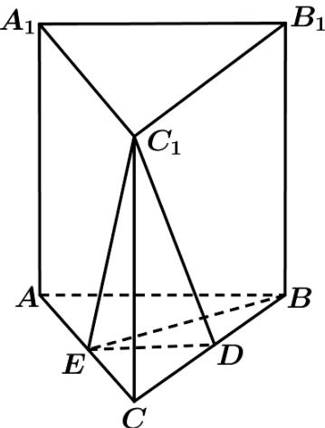

> [!faq]- 《zhenti-专题21 立体几何大题综合》例题解析
>
> > [!success]- **【答案】** 详见解析
>
> > [!note]- **【分析】**
> > $^{
> > (1)}$ 由题意结合几何体的空间结构特征和线面平行的判定定理即可证得题中的结论；
>
> > [!note]- **【解析】**
> > （1）因为 D, E 分别为 BC, AC 的中点，
> >
> > 
> >
> > 所以 $ED^{\parallel}AB$ .
> >
> > 在直三棱柱 $ABC-A_{1}B_{1}C_{1}$ 中， $AB^{\parallel}A_{1}B_{1}$
> >
> > 所以 $A_{1}B_{1} \parallel ED$ .
> >
> > 又因为 $ED \subset$ 平面 $DEC_{1}$ ， $A_{1}B_{1} \not\subset$ 平面 $DEC_{1}$ ，
> >
> > 所以 $A_{1}B_{1}$ 平面 $DEC_{1}$
