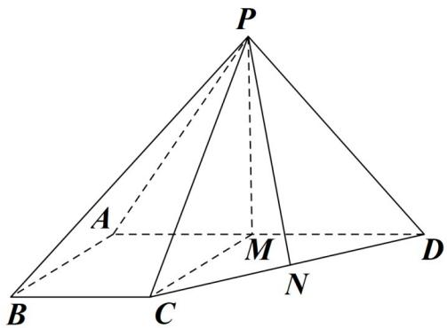

> [!faq]- 《zhenti-专题21 立体几何大题综合》例题解析
>
> > [!success]- **【答案】** （1）见解析
>
> > [!note]- **【解析】**
> > (1) 证明：直线 $BC //$ 平面 $PAD$ ;
> >
> > 
> >
> >
> > 试题解析：
> >
> > (1) 在平面 ABCD 内，因为 $\angle BAD = \angle ABC = 90^{0}$ ，所以 BC // AD.
> >
> > 又 $BC \not\subset$ 平面 $PAD, AD \subset$ 平面 $PAD$ , 故 $BC \parallel$ 平面 $PAD$ .
> >
> > 
