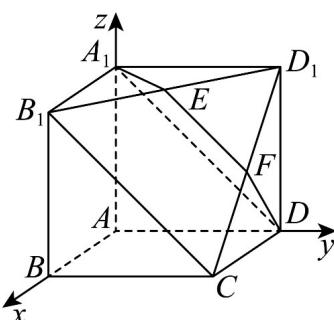

> [!faq]- 《zhenti-专题21 立体几何大题综合》例题解析
>
> > [!success]- **【答案】** （Ⅰ） $EF // B_{1}C$ ； 试题
>
> > [!note]- **【解析】**
> > 解析：（1）证明：由正方形的性质可知 $A_{1}B_{1} // AB // DC$ ，且 $A_{1}B_{1} = AB = DC$ ，所以四边形 $A_{1}B_{1}CD$ 为平行四边形，从而 $B_{1}C // A_{1}D$ ，又 $A_{1}D \subset$ 面 $A_{1}DE$ ， $B_{1}C \notin$ 面 $A_{1}DE$ ，于是 $B_{1}C //$ 面 $A_{1}DE$ ，又 $B_{1}C \subset$ 面 $B_{1}CD_{1}$ 而面 $A_{1}DE \cap$ 面 $B_{1}CD_{1} = EF$ ，所以 $EF // B_{1}C$ .
> >
> > 
