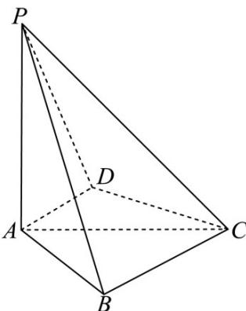

<!-- question-source:start -->
1．（2024·全国新I卷·高考真题）如图，四棱锥 P-ABCD 中， $PA \perp$ 底面 ABCD，PA = AC = 2，
BC = 1, AB = $\sqrt{3}$

<!-- question-source:end -->

![[高中/真题/按题型分类/专题21 立体几何大题综合/考点01_空间中的平行关系_第一问_/真题/answers/Q00035740A1.md]]
