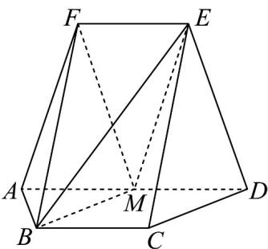

<!-- question-source:start -->
2．（2024·全国甲卷·高考真题）如图，在以 A, B, C, D, E, F 为顶点的五面体中，四边形 ABCD 与四边形 ADEF 均为等腰梯形，EF // AD, BC // AD，AD = 4, AB = BC = EF = 2， $ED = \sqrt{10}$ , $FB = 2\sqrt{3}$ ，M 为 AD 的中点．

<!-- question-source:end -->

![[高中/真题/按题型分类/专题21 立体几何大题综合/考点01_空间中的平行关系_第一问_/真题/answers/Q00035741A1.md]]
