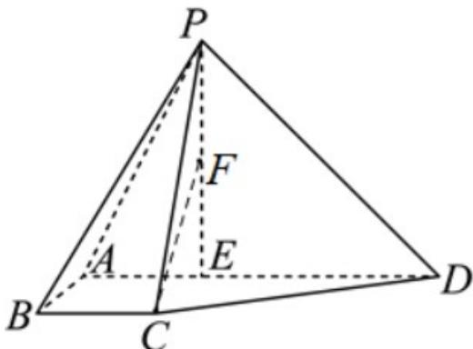

<!-- question-source:start -->
3．（2024·北京·高考真题）如图，在四棱锥 P-ABCD 中，BC//AD，AB=BC=1，AD=3，点 E 在 AD 上，且 $PE \perp AD$ ，PE=DE=2。

<!-- question-source:end -->

![[高中/真题/按题型分类/专题21 立体几何大题综合/考点01_空间中的平行关系_第一问_/真题/answers/Q00035742A1.md]]
