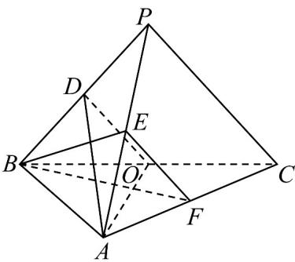

<!-- question-source:start -->
6. (2023·全国甲卷·高考真题) 如图，在三棱锥 $P - ABC$ 中， $AB \perp BC$ ， $AB = 2$ ， $BC = 2\sqrt{2}$ ， $PB = PC = \sqrt{6}$ ， $BP$ ， $AP$ ， $BC$ 的中点分别为 $D$ ， $E$ ， $O$ ， $AD = \sqrt{5}DO$ ，点 $F$ 在 $AC$ 上， $BF \perp AO$ 。

(1)证明： $EF \parallel$ 平面 ADO；
<!-- question-source:end -->

![[高中/真题/按题型分类/专题21 立体几何大题综合/考点01_空间中的平行关系_第一问_/真题/answers/Q00035745A1.md]]
