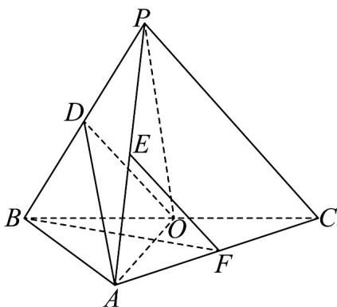

<!-- question-source:start -->
7．（2023·全国乙卷·高考真题）如图，在三棱锥 P-ABC 中， $AB \perp BC$ ，AB = 2， $BC = 2\sqrt{2}$ ， $PB = PC = \sqrt{6}$ ，BP,AP,BC 的中点分别为 D,E,O ，点 F 在 AC 上， $BF \perp AO$

<!-- question-source:end -->

![[高中/真题/按题型分类/专题21 立体几何大题综合/考点01_空间中的平行关系_第一问_/真题/answers/Q00035746A1.md]]
