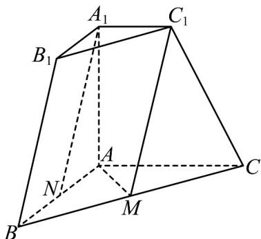

<!-- question-source:start -->
8. (2023·天津·高考真题) 如图, 在三棱台 $ABC - A_{1}B_{1}C_{1}$ 中, $A_{1}A \perp$ 平面

$ABC, AB \perp AC, AB = AC = AA_{1} = 2, A_{1}C_{1} = 1$ ，M 为 BC 中点，N 为 AB 的中点，

(1)求证： $A_{1}N / /$ 平面 $AMC_{1}$
<!-- question-source:end -->

![[高中/真题/按题型分类/专题21 立体几何大题综合/考点01_空间中的平行关系_第一问_/真题/answers/Q00035747A1.md]]
