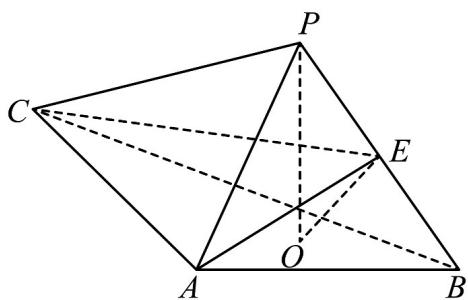

<!-- question-source:start -->
9．（2022·全国新Ⅱ卷·高考真题）如图，PO 是三棱锥 P-ABC 的高，PA=PB， $AB\perp AC$ ，E 是 PB 的中点．

(1)证明： $OE / /$ 平面PAC；
<!-- question-source:end -->

![[高中/真题/按题型分类/专题21 立体几何大题综合/考点01_空间中的平行关系_第一问_/真题/answers/Q00035748A1.md]]
