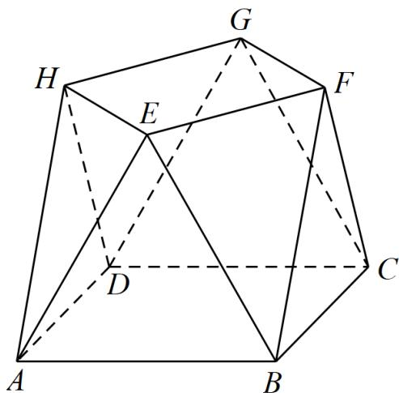

<!-- question-source:start -->
10．（2022·全国甲卷·高考真题）小明同学参加综合实践活动，设计了一个封闭的包装盒，包装盒如图所示：底面ABCD是边长为8（单位：cm）的正方形， $\triangle EAB,\triangle FBC,\triangle GCD,\triangle HDA$ 均为正三角形，且它们所在的平面都与平面ABCD垂直．

<!-- question-source:end -->

![[高中/真题/按题型分类/专题21 立体几何大题综合/考点01_空间中的平行关系_第一问_/真题/answers/Q00035749A1.md]]
