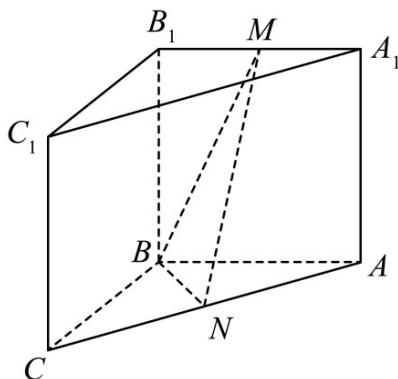

<!-- question-source:start -->
12．（2022·北京·高考真题）如图，在三棱柱 $ABC-A_{1}B_{1}C_{1}$ 中，侧面 $BCC_{1}B_{1}$ 为正方形，平面 $BCC_{1}B_{1}\perp$ 平面 $ABB_{1}A_{1}$ ，AB=BC=2，M，N分别为 $A_{1}B_{1}$ ，AC的中点．

<!-- question-source:end -->

![[高中/真题/按题型分类/专题21 立体几何大题综合/考点01_空间中的平行关系_第一问_/真题/answers/Q00035750A1.md]]
