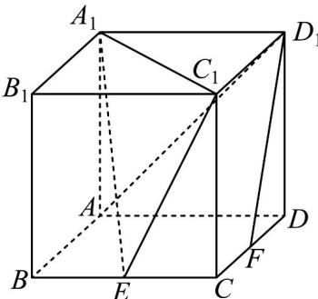

<!-- question-source:start -->
13.（2021·天津·高考真题）如图，在棱长为 $^{2}$ 的正方体 $ABCD-A_{1}B_{1}C_{1}D_{1}$ 中，E为棱BC的中点，F为棱CD的中点。

(1) 求证： $D_{1}F //$ 平面 $A_{1}EC_{1}$ ;
<!-- question-source:end -->

![[高中/真题/按题型分类/专题21 立体几何大题综合/考点01_空间中的平行关系_第一问_/真题/answers/Q00035751A1.md]]
