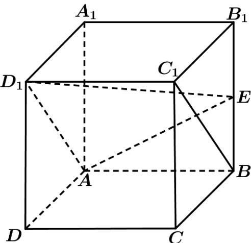

<!-- question-source:start -->
14．（2020·北京·高考真题）如图，在正方体 $ABCD-A_{1}B_{1}C_{1}D_{1}$ 中，E 为 $BB_{1}$ 的中点.

(Ⅰ) 求证： $BC_{1} //$ 平面 $AD_{1}E$ ；
<!-- question-source:end -->

![[高中/真题/按题型分类/专题21 立体几何大题综合/考点01_空间中的平行关系_第一问_/真题/answers/Q00035752A1.md]]
