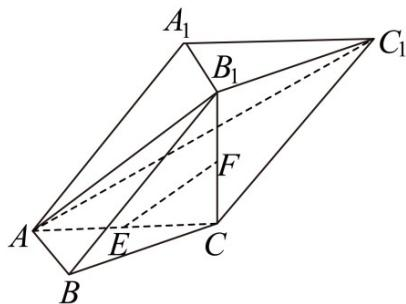

<!-- question-source:start -->
15. (2020·江苏·高考真题) 在三棱柱 $ABC - A_{1}B_{1}C_{1}$ 中， $AB \perp AC$ ， $B_{1}C \perp$ 平面 $ABC$ ， $E$ ， $F$ 分别是 $AC$ ， $B_{1}C$ 的中点。

(1) 求证： $EF \parallel$ 平面 $AB_{1}C_{1}$ ;
<!-- question-source:end -->

![[高中/真题/按题型分类/专题21 立体几何大题综合/考点01_空间中的平行关系_第一问_/真题/answers/Q00035753A1.md]]
