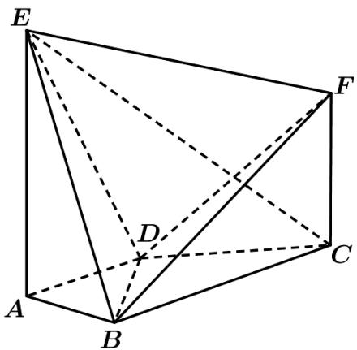

<!-- question-source:start -->
18．（2019·天津·高考真题）如图， $AE \perp$ 平面 $ABCD$ ， $CF\parallel AE$ ， $AD\parallel BC$ ， $AD \perp AB$ ， $AB = AD = 1$ ， $AE = BC = 2$

(Ⅰ) 求证： $BF \parallel$ 平面 ADE；
<!-- question-source:end -->

![[高中/真题/按题型分类/专题21 立体几何大题综合/考点01_空间中的平行关系_第一问_/真题/answers/Q00035756A1.md]]
