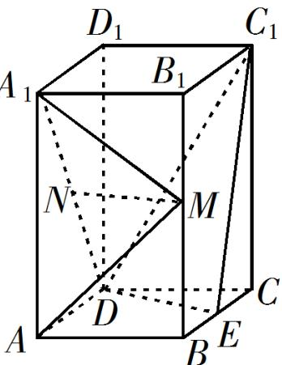

<!-- question-source:start -->
19．（2019·全国·高考真题）如图，直四棱柱 $ABCD-A_{l}B_{l}C_{l}D_{1}$ 的底面是菱形， $\mathsf{AA}_{1}=4$ ， $AB=2$ ， $\angle BAD=60^{\circ}$ ， $E$ ， $M$ ， $N$ 分别是 $BC$ ， $\mathsf{BB}_{1}$ ， $\mathsf{A}_{1}\mathsf{D}$ 的中点·

(1) 证明： $MN^{\parallel}$ 平面 $C_{1}DE$ ;
<!-- question-source:end -->

![[高中/真题/按题型分类/专题21 立体几何大题综合/考点01_空间中的平行关系_第一问_/真题/answers/Q00035757A1.md]]
