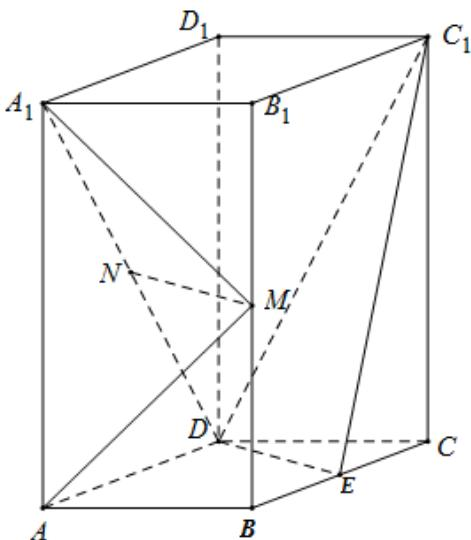

<!-- question-source:start -->
20．（2019·全国·高考真题）如图，直四棱柱 $ABCD-A_{1}B_{1}C_{1}D_{1}$ 的底面是菱形， $AA_{1}=4$ ，AB=2， $\angle BAD=60^{\circ}$ ，E，M，N 分别是 BC， $BB_{1}$ ， $A_{1}D$ 的中点．

<!-- question-source:end -->

![[高中/真题/按题型分类/专题21 立体几何大题综合/考点01_空间中的平行关系_第一问_/真题/answers/Q00035758A1.md]]
