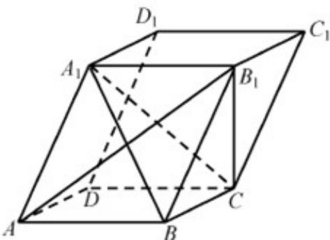

<!-- question-source:start -->
21. (2018·江苏·高考真题) 在平行六面体 $ABCD - A_1B_1C_1D_1$ 中， $AA_1 = AB, AB_1 \perp B_1C_1$

求证： $(1)$ AB // 平面 $A_{1}B_{1}C$ ;

<!-- question-source:end -->

![[高中/真题/按题型分类/专题21 立体几何大题综合/考点01_空间中的平行关系_第一问_/真题/answers/Q00035759A1.md]]
