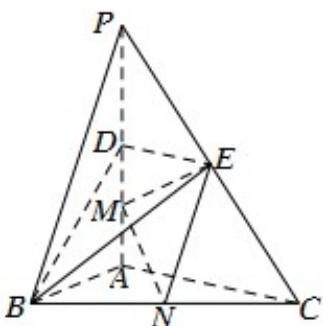

<!-- question-source:start -->
22．（2017·天津高考真题）如图，在三棱锥 P-ABC 中， $PA \perp$ 底面 ABC ， $\angle BAC = 90^{\circ}$ ．点 D ，E ，N 分别为棱 PA ，PC ，BC 的中点，M 是线段 AD 的中点，PA = AC = 4 ，AB = 2．

<!-- question-source:end -->

![[高中/真题/按题型分类/专题21 立体几何大题综合/考点01_空间中的平行关系_第一问_/真题/answers/Q00035760A1.md]]
