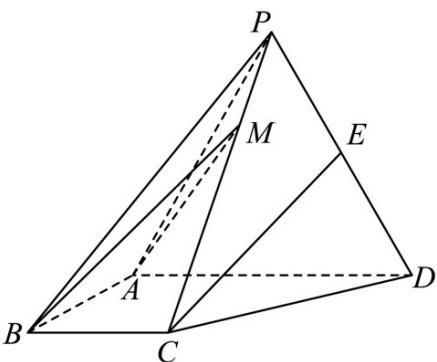

<!-- question-source:start -->
24. (2017·全国·高考真题) 如图, 四棱锥 P-ABCD 中, 侧面 PAD 是边长为 $^{2}$ 的等边三角形且垂直于底面 ABCD, $AB = BC = \frac{1}{2} AD, \angle BAD = \angle ABC = 90^{\circ}, E$ 是 PD 的中点.

(1) 证明：直线 $CE \parallel$ 平面 $PAB$ ;

<!-- question-source:end -->

![[高中/真题/按题型分类/专题21 立体几何大题综合/考点01_空间中的平行关系_第一问_/真题/answers/Q00035762A1.md]]
