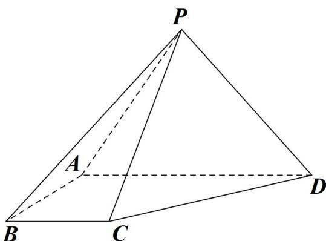

<!-- question-source:start -->
25.（2017·全国·高考真题）四棱锥 $P - ABCD$ 中，侧面 $PAD$ 为等边三角形且垂直于底面 $ABCD$ ， $AB = BC = \frac{1}{2} AD, \angle BAD = \angle ABC = 90^{\circ}$ .

(1) 证明：直线 $BC //$ 平面 $PAD$ ;

<!-- question-source:end -->

![[高中/真题/按题型分类/专题21 立体几何大题综合/考点01_空间中的平行关系_第一问_/真题/answers/Q00035763A1.md]]
