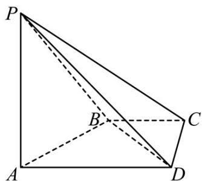

<!-- question-source:start -->
27. (2016·四川·高考真题) 如图, 在四棱锥 P-ABCD 中, PA⊥CD, AD∥BC, ∠ADC=∠PAB=90°, BC=CD= $\frac{1}{2}$ AD

(Ⅰ) 在平面 $\mathtt{PAD}$ 内找一点 $\mathtt{M}$ ，使得直线 $\mathtt{CMII}$ 平面 $\mathtt{PAB}$ ，并说明理由；
<!-- question-source:end -->

![[高中/真题/按题型分类/专题21 立体几何大题综合/考点01_空间中的平行关系_第一问_/真题/answers/Q00035765A1.md]]
