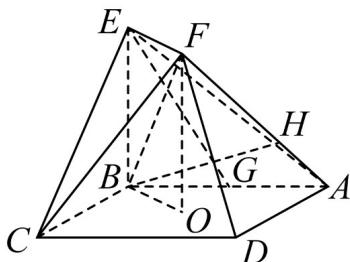

<!-- question-source:start -->
29. (2016·天津·高考真题) 如图, 正方形 $ABCD$ 的中心为 $O$ , 四边形 $OBEF$ 为矩形, 平面 $OBEF \perp$ 平面 $ABCD$ , 点 $G$ 为 $AB$ 的中点, $AB=BE=2$ .

(Ⅰ) 求证： $EG \parallel$ 平面 ADF；
<!-- question-source:end -->

![[高中/真题/按题型分类/专题21 立体几何大题综合/考点01_空间中的平行关系_第一问_/真题/answers/Q00035767A1.md]]
