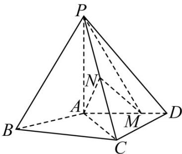

<!-- question-source:start -->
30．（2016·全国高考真题）如图，四棱锥 P-ABCD 中， $PA^{\perp}$ 底面 ABCD， $AD^{\parallel}BC$ ， $AB=AD=AC=3$ ， $PA=BC=4$ ，M为线段AD上一点， $AM=2MD$ ，N为PC的中点.

(Ⅰ) 证明 $MN^{\parallel}$ 平面 $PAB$ ;
<!-- question-source:end -->

![[高中/真题/按题型分类/专题21 立体几何大题综合/考点01_空间中的平行关系_第一问_/真题/answers/Q00035768A1.md]]
