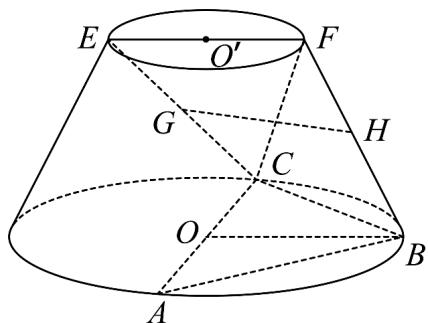

<!-- question-source:start -->
31. （2016·山东·高考真题）在如图所示的圆台中，AC 是下底面圆 O 的直径，EF 是上底面圆 O' 的直径，FB 是圆台的一条母线。

(Ⅰ) 已知 G,H 分别为 EC，FB 的中点，求证：GH∥平面 ABC；
<!-- question-source:end -->

![[高中/真题/按题型分类/专题21 立体几何大题综合/考点01_空间中的平行关系_第一问_/真题/answers/Q00035769A1.md]]
