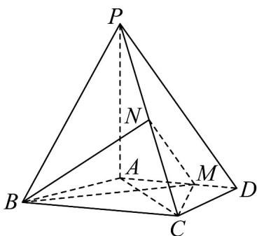

<!-- question-source:start -->
32．（2016·全国·高考真题）如图，四棱锥 P-ABCD 中，PA⊥平面 ABCD，AD∥BC，
AB = AD = AC = 3，PA = BC = 4，M 为线段 AD 上一点，AM = 2MD，N 为 PC 的中点。

(1) 证明 $MN \parallel$ 平面 $PAB$ ;

<!-- question-source:end -->

![[高中/真题/按题型分类/专题21 立体几何大题综合/考点01_空间中的平行关系_第一问_/真题/answers/Q00035770A1.md]]
