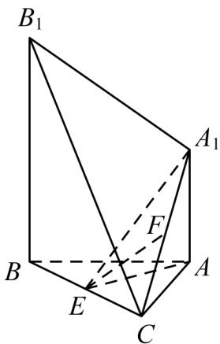

<!-- question-source:start -->
34. (2015·天津·高考真题) 如图, 已知 $AA_{1} \perp$ 平面 $\mathrm{ABC}, BB_{1} \parallel AA_{1}$ , $\mathrm{AB} = \mathrm{AC} = 3$ , $BC = 2\sqrt{5}$ , $AA_{1} = \sqrt{7}$ ,

$BB_{1}=2\sqrt{7}$ . 点 E,F 分别是 BC, $A_{1}B_{1}$ 的中点.

(Ⅰ) 求证: $EF \parallel$ 平面 $A_{1}B_{1}BA$ ;
<!-- question-source:end -->

![[高中/真题/按题型分类/专题21 立体几何大题综合/考点01_空间中的平行关系_第一问_/真题/answers/Q00035772A1.md]]
