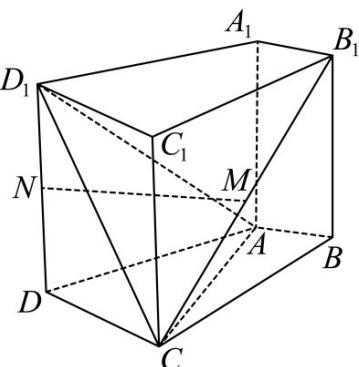

<!-- question-source:start -->
35.（2015·天津·高考真题）如图，在四棱柱 $ABCD - A_1B_1C_1D_1$ 中，侧棱 $A_{1}A \perp$ 底面 $ABCD$ ， $AB \perp AC$ ， $AB = 1$ ， $AC = AA_{1} = 2$ ， $AD = CD = \sqrt{5}$ ，且点 $M$ 和 $N$ 分别为 $B_{1}C$ 和 $D_{1}D$ 的中点·

<!-- question-source:end -->

![[高中/真题/按题型分类/专题21 立体几何大题综合/考点01_空间中的平行关系_第一问_/真题/answers/Q00035773A1.md]]
