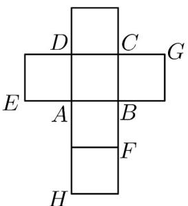
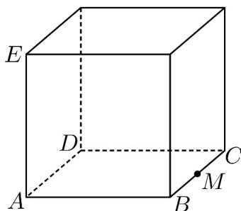

<!-- question-source:start -->
36. (2015·四川高考真题) 一个正方体的平面展开图及该正方体的直观图的示意图如图所示，在正方体中，设 BC 的中点为 M，GH 的中点为 N

<!-- question-source:end -->

![[高中/真题/按题型分类/专题21 立体几何大题综合/考点01_空间中的平行关系_第一问_/真题/answers/Q00035774A1.md]]
