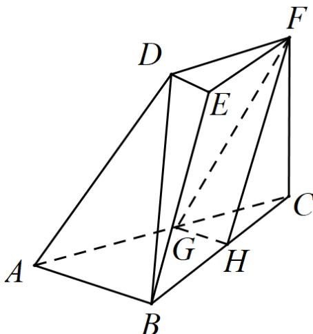

<!-- question-source:start -->
37. (2015·山东·高考真题) 如图, 三棱台 $DEF - ABC$ 中, $AB = 2DE$ , $G$ , $H$ 分别为 $AC$ , $BC$ 的中点.

<!-- question-source:end -->

![[高中/真题/按题型分类/专题21 立体几何大题综合/考点01_空间中的平行关系_第一问_/真题/answers/Q00035775A1.md]]
