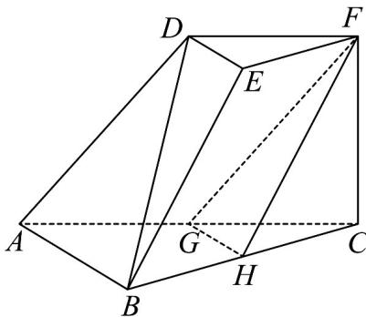

<!-- question-source:start -->
38. (2015·山东·高考真题) 如图，在三棱台 $DEF - ABC$ 中， $AB = 2DE, G, H$ 分别为 $AC, BC$ 的中点。

<!-- question-source:end -->

![[高中/真题/按题型分类/专题21 立体几何大题综合/考点01_空间中的平行关系_第一问_/真题/answers/Q00035776A1.md]]
