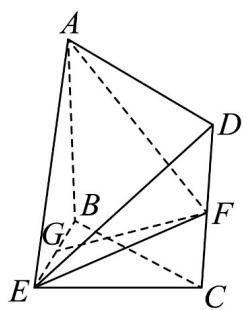

<!-- question-source:start -->
40．（2015·福建·高考真题）如图，在几何体 $ABCDE$ 中，四边形ABCD是矩形， $AB \perp$ 平面 $BEC$ ， $BE \perp EC$ ， $AB = BE = EC$ ， $G$ ， $F$ 分别是线段 $BE$ ， $DC$ 的中点.

<!-- question-source:end -->

![[高中/真题/按题型分类/专题21 立体几何大题综合/考点01_空间中的平行关系_第一问_/真题/answers/Q00035778A1.md]]
