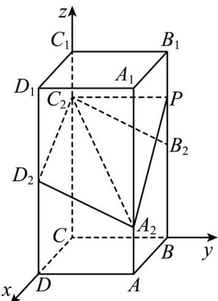

> [!faq]- 《专题21 立体几何大题综合》真题解析
>
> > [!success]- **【答案】** 详见解析
>
> > [!note]- **【分析】**
> > （ $^{1}$ ）建立空间直角坐标系，利用向量坐标相等证明；
>
> > [!note]- **【解析】**
> > （1）以 $C$ 为坐标原点， $CD, CB, CC_{1}$ 所在直线为 $x, y, z$ 轴建立空间直角坐标系，如图，
> > 
> > 则 $C(0,0,0), C_2(0,0,3), B_2(0,2,2), D_2(2,0,2), A_2(2,2,1)$
> > $$
> > \therefore B _ {2} C _ {2} = (0, - 2, 1), A _ {2} D _ {2} = (0, - 2, 1)
> > $$
> > $\therefore B_{2}C_{2}\parallel A_{2}D_{2}$
> > 又 $B_{2}C_{2}, A_{2}D_{2}$ 不在同一条直线上，
> > $\therefore B_{2}C_{2}\parallel A_{2}D_{2}$
