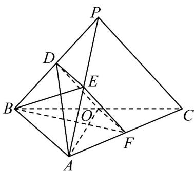

> [!faq]- 《专题21 立体几何大题综合》真题解析
>
> > [!success]- **【答案】** 详见解析
>
> > [!note]- **【分析】**
> > 【分析】（ $^{1}$ ）根据给定条件，证明四边形 ODEF 为平行四边形，再利用线面平行的判定推理作答
>
> > [!note]- **【解析】**
> > 【详解】（1）连接 $DE, OF$ ，设 $AF = tAC$ ，则 $\overline{BF} = \overline{BA} + \overline{AF} = (1 - t)\overline{BA} + tBC$ ， $\overline{AO} = -\overline{BA} + \frac{1}{2}\overline{BC}$ ， $BF \perp AO$ ，
> > 则 $BF\cdot AO = [(1 - t)BA + tBC]\cdot (-BA + \frac{1}{2} BC) = (t - 1)BA^2 +\frac{1}{2} tBC^2 = 4(t - 1) + 4t = 0$
> > 解得 $t = \frac{1}{2}$ ，则 $F$ 为 $AC$ 的中点，由 $D,E,O,F$ 分别为 $PB,PA,BC,AC$ 的中点，
> > 
> > 于是 $DE // AB, DE = \frac{1}{2} AB, OF // AB, OF = \frac{1}{2} AB$ ，即 $DE // OF, DE = OF$ ，则四边形 $ODEF$ 为平行四边形， $EF // DO, EF = DO$ ，又 $EF \notin$ 平面 $ADO, DO \subset$ 平面 $ADO$ ，
> > 所以 EF // 平面 ADO .
