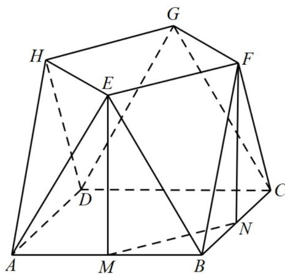
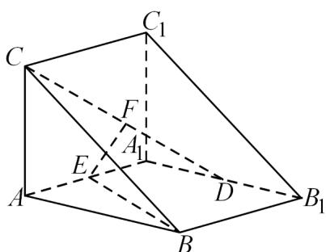
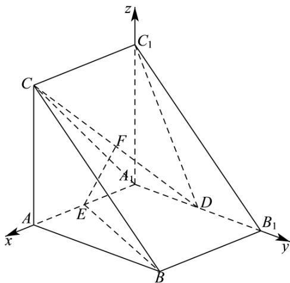

> [!faq]- 《专题21 立体几何大题综合》真题解析
>
> > [!success]- **【答案】** 详见解析
>
> > [!note]- **【分析】**
> > （1）分别取 $AB, BC$ 的中点 $M, N$ ，连接 $MN$ ，由平面知识可知 $EM \perp AB, FN \perp BC$ ， $EM = FN$ ，依题从而可证 $EM \perp$ 平面 $ABCD$ ， $FN \perp$ 平面 $ABCD$ ，根据线面垂直的性质定理可知 $EM // FN$ ，即可知四边形 $EMNF$ 为平行四边形，于是 $EF // MN$ ，最后根据线面平行的判定定理即可证出；
>
> > [!note]- **【解析】**
> > （1）如图所示：
> > 
> > 分别取 $AB, BC$ 的中点 $M, N$ ，连接 $MN$ ，因为 $\triangle EAB, \triangle FBC$ 为全等的正三角形，所以 $EM \perp AB, FN \perp BC$ ， $EM = FN$ ，又平面 $EAB \perp$ 平面 $ABCD$ ，平面 $EAB \cap$ 平面 $ABCD = AB$ ， $EM \subset$ 平面 $EAB$ ，所以 $EM \perp$ 平面 $ABCD$ ，同理可得 $FN \perp$ 平面 $ABCD$ ，根据线面垂直的性质定理可知 $EM // FN$ ，而 $EM = FN$ ，所以四边形 $EMNF$ 为平行四边形，所以 $EF // MN$ ，又 $EF \notin$ 平面 $ABCD$ ， $MN \subset$ 平面 $ABCD$ ，所以 $EF //$ 平面 $ABCD$ 。11．（2022·天津·高考真题）直三棱柱 $ABC - A_1B_1C_1$ 中， $AA_1 = AB = AC = 2, AA_1 \perp AB, AC \perp AB$ ， $D$ 为 $A_1B_1$ 的中点， $E$ 为 $AA_1$ 的中点， $F$ 为 $CD$ 的中点。
> > 
> > (1)求证： $EF \parallel$ 平面 ABC；
> > 【答案】(1)证明见解析
> > 【分析】（1）以点 $A_{1}$ 为坐标原点， $A_{1}A$ 、 $A_{1}B_{1}$ 、 $A_{1}C_{1}$ 所在直线分别为 $x$ 、 $y$ 、 $z$ 轴建立空间直角坐标系，利用空间向量法可证得结论成立；
> > 【详解】（1）证明：在直三棱柱 $ABC-A_{1}B_{1}C_{1}$ 中， $AA_{1}\perp$ 平面 $A_{1}B_{1}C_{1}$ ，且 $AC\perp AB$ ，则 $A_{1}C_{1}\perp A_{1}B_{1}$ 以点 $A_{1}$ 为坐标原点， $A_{1}A$ 、 $A_{1}B_{1}$ 、 $A_{1}C_{1}$ 所在直线分别为x、y、z轴建立如下图所示的空间直角坐标系，则 $A(2,0,0)$ 、 $B(2,2,0)$ 、 $C(2,0,2)$ 、 $A_1(0,0,0)$ 、 $B_1(0,2,0)$ 、 $C_1(0,0,2)$ 、 $D(0,1,0)$ 、 $E(1,0,0)$ 、 $F\left(1,\frac{1}{2},1\right)$ ，则 $\overline{EF} = \left(0,\frac{1}{2},1\right)$ ，
> > 
> > 易知平面 $ABC$ 的一个法向量为 $\stackrel{\square}{m} = (1,0,0)$ ，则 $\stackrel{\square\square\square}{EF} \cdot \stackrel{\square}{m} = 0$ ，故 $\stackrel{\square\square\square}{EF} \perp \stackrel{\square}{m}$
> > ∵ EF ∉ 平面 ABC，故 $EF \parallel$ 平面 ABC.
