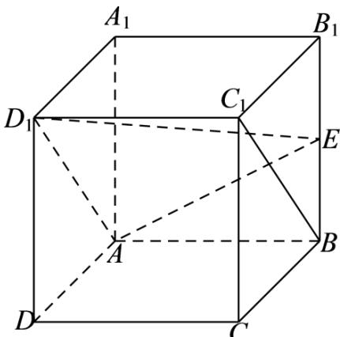
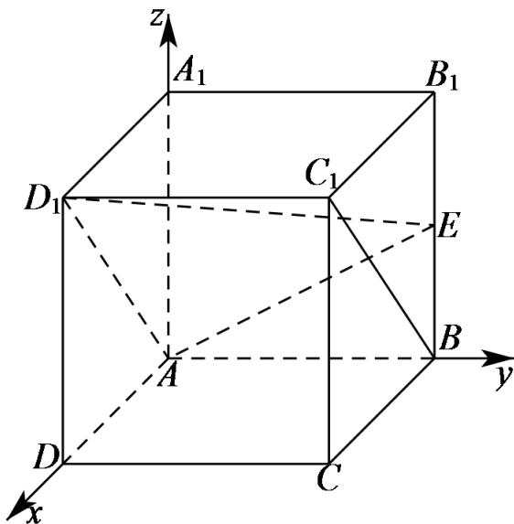

> [!faq]- 《专题21 立体几何大题综合》真题解析
>
> > [!success]- **【答案】** 详见解析
>
> > [!note]- **【分析】**
> > 【分析】（Ⅰ）证明出四边形 $ABC_{1}D_{1}$ 为平行四边形，可得出 $BC_{1}//AD_{1}$ ，然后利用线面平行的判定定理可证得结论；也可利用空间向量计算证明；
>
> > [!note]- **【解析】**
> > 【详解】（Ⅰ）[方法一]：几何法
> > 如下图所示：
> > 
> > 在正方体 $ABCD - A_{1}B_{1}C_{1}D_{1}$ 中， $AB//A_{1}B_{1}$ 且 $AB = A_{1}B_{1}$ ， $A_{1}B_{1}//C_{1}D_{1}$ 且 $A_{1}B_{1} = C_{1}D_{1}$
> > $\therefore AB//C_{1}D_{1}$ 且 $AB = C_{1}D_{1}$ ，所以，四边形 $ABC_{1}D_{1}$ 为平行四边形，则 $BC_{1}//AD_{1}$
> > ∵ $BC_{1} \not\subset$ 平面 $AD_{1}E$ ， $AD_{1} \subset$ 平面 $AD_{1}E$ ，∴ $BC_{1}//$ 平面 $AD_{1}E$ ；
> > [方法二]: 空间向量坐标法
> > 以点 A 为坐标原点，AD、AB、 $AA_{1}$ 所在直线分别为 x、y、z 轴建立如下图所示的空间直角坐标系
> > A-xyz
> > 
> > 设正方体 $ABCD - A_{1}B_{1}C_{1}D_{1}$ 的棱长为 2，则 $A(0,0,0)$ 、 $A_{1}(0,0,2)$ 、 $D_{1}(2,0,2)$ 、 $E(0,2,1)$ ， $AD_{1} = (2,0,2)$ ， $AE = (0,2,1)$
> > 设平面 $AD_{1}E$ 的法向量为 $n = (x,y,z)$ ，由 $\left\{ \begin{array}{l} n \cdot AD_{1} = 0 \\ n \cdot AE = 0 \end{array} \right.$ ，得 $\left\{ \begin{array}{l} 2x + 2z = 0 \\ 2y + z = 0 \end{array} \right.$
> > 令 z = -2 ，则 x = 2 ，y = 1 ，则 $n = (2, 1, -2)$ .
> > 又∵向量 $BC_{1}=(2,0,2),BC_{1}\cdot n=2\times2+0\times1+2\times(-2)=0$
> > 又∵ $BC_{1} \not\subset$ 平面 $AD_{1}E$ ，∴ $BC_{1} //$ 平面 $AD_{1}E$ ；
