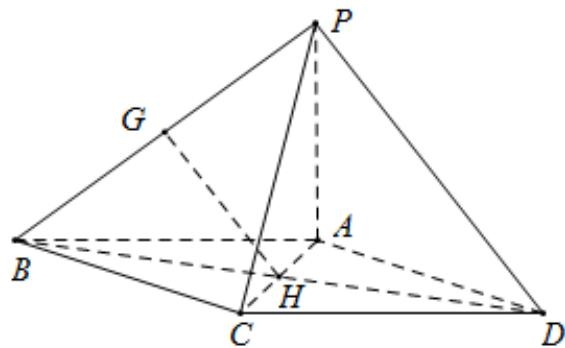

> [!faq]- 《专题21 立体几何大题综合》真题解析
>
> > [!success]- **【答案】** 详见解析
>
> > [!note]- **【分析】**
> > 【分析】（1）连接 $BD$ ，结合平行四边形的性质，以及三角形中位线的性质，得到 $GH\| PD$ ，利用线面平行的判定定理证得结果；
>
> > [!note]- **【解析】**
> > 【详解】（1）证明：连接 BD，易知 $AC \cap BD = H$ ，BH = DH，
> > 
> > 又由 $BG = PG$ ，故 $GH\| PD$
> > 又因为 $GH \notin$ 平面 $PAD$ ， $PD \subset$ 平面 $PAD$
> > 所以 $GH \parallel$ 平面 PAD.
