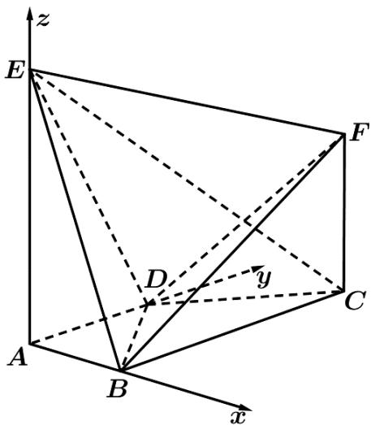

> [!faq]- 《专题21 立体几何大题综合》真题解析
>
> > [!success]- **【答案】** 详见解析
>
> > [!note]- **【分析】**
> > 【分析】首先利用几何体的特征建立空间直角坐标系
> >
> > (I)利用直线 $BF$ 的方向向量和平面 $ADE$ 的法向量的关系即可证明线面平行；
>
> > [!note]- **【解析】**
> > 【详解】依题意，可以建立以 $A$ 为原点，分别以 $AB, AD, AE$ 的方向为 $x$ 轴， $y$ 轴， $z$ 轴正方向的空间直角坐标系(如图)，
> > 
> > 可得 $A(0,0,0), B(1,0,0), C(1,2,0), D(0,1,0), E(0,0,2)$ .
> > 设 $CF = h(h > 0)$ ，则 $F(1,2,h)$ .
> > (I)依题意， $AB=\left(1,0,0\right)$ 是平面ADE的法向量，
> > 又 $BF = (0,2,h)$ ，可得 $BF\cdot AB = 0$
> > 又因为直线 $BF \not\subset$ 平面 ADE ，所以 $BF \parallel$ 平面 ADE ·
