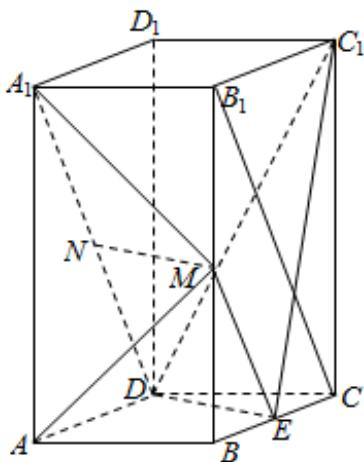

> [!faq]- 《专题21 立体几何大题综合》真题解析
>
> > [!success]- **【答案】** 详见解析
>
> > [!note]- **【分析】**
> > （1）利用三角形中位线和 $A_{1}D / / B_{1}C$ 可证得 $ME / / ND$ ，证得四边形MNDE为平行四边形，进而证得 $MN / / DE$ ，根据线面平行判定定理可证得结论；
>
> > [!note]- **【解析】**
> > （1）连接ME， $B_{1}C$
> > 
> > ，分别为 ，中点 为 的中位线
> > $\because M \quad E \quad BB_{1} \quad BC \quad \therefore ME \quad \Delta B_{1}BC$
> > $\therefore ME // B_{1}C$ 且 $ME = \frac{1}{2} B_{1}C$
> > 又 $N$ 为 $A_{1}D$ 中点，且 $A_{1}D \underline{=} //B_{1}C \therefore ND //B_{1}C$ 且 $ND = \frac{1}{2} B_{1}C$
> > $\therefore ME \underline{ // ND}$ $\therefore$ 四边形 $MNDE$ 为平行四边形
> > $\therefore MN // DE$ ，又 $MN \not\subset$ 平面 $C_1DE$ ， $DE \subset$ 平面 $C_1DE$
> > ∴MN//平面 $C_{1}DE$
