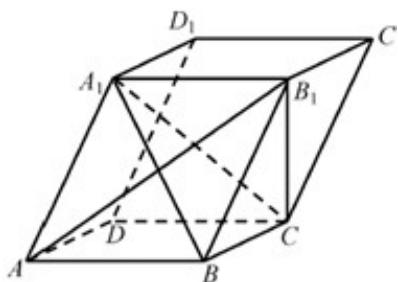

> [!faq]- 《专题21 立体几何大题综合》真题解析
>
> > [!success]- **【答案】** 详见解析
>
> > [!note]- **【分析】**
> > 本题未单列分析。
>
> > [!note]- **【解析】**
> > 【答案】（1）见解析
> > 【详解】分析： $\left(^{1}\right)$ 先根据平行六面体得线线平行，再根据线面平行判定定理得结论；
> > 证明：（1）在平行六面体 $ABCD - A_{1}B_{1}C_{1}D_{1}$ 中， $AB^{\parallel}A_{1}B_{1}$
> > 
> > 因为 $AB \not\subset$ 平面 $A_{l}B_{l}C$ ， $A_{l}B_{l} \subset$ 平面 $A_{l}B_{l}C$ ，
> > 所以 $AB^{\parallel}$ 平面 $A_{1}B_{1}C$ .
