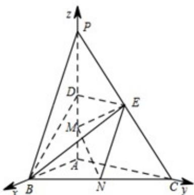

> [!faq]- 《专题21 立体几何大题综合》真题解析
>
> > [!success]- **【答案】** （1）证明见解析； 试题
>
> > [!note]- **【分析】**
> > 本题未单列分析。
>
> > [!note]- **【解析】**
> > 如图，以 $A$ 为原点，分别以 $\overline{AB}$ ， $\overline{AC}$ ， $\overline{AP}$ 方向为 $x$ 轴、 $y$ 轴、 $z$ 轴正方向建立空间直角坐标系。依题意可得 $A(0,0,0)$ ， $B(2,0,0)$ ， $C(0,4,0)$ ， $P(0,0,4)$ ， $D(0,0,2)$ ， $E(0,2,2)$ ， $M(0,0,1)$ ， $N(1,2,0)$ 。
> > 
> > (1) 证明： $\overline{D}E=(0,2,0)$ ， $\overline{DB}=(2,0,-2)$ ·设 $n=(x,y,z)$ ，为平面BDE的法向量，
> > 则 $\left\{ \begin{array}{l}n\cdot \overline{\square}\overline{\square}E = 0\\ n\cdot DB = 0 \end{array} \right.$ ，即 $\left\{ \begin{array}{l}2y = 0\\ 2x - 2z = 0 \end{array} \right.$ ·不妨设 ${}_{z = 1}$ ，可得 $n = (1,0,1)\cdot$ 又 $\frac{\square\square\square\square\square}{MN} = (1,2,$ ，-1），可得 $\frac{\square\square\square\square\square}{MN}\cdot n = 0$
> > 因为 $MN \not\subset$ 平面 BDE，所以 MN// 平面 BDE.
